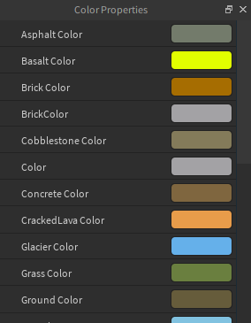
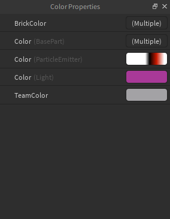

# ColorProps

ColorProps is a plugin that lets you use [ColorPane](https://github.com/Blupo/ColorPane) to view and edit the color properties of objects in Studio.

If you want to support ColorPane's development, consider [donating](https://ko-fi.com/blupo).

## Installing

You can install ColorProps [from the library](https://www.roblox.com/library/6494015679). You will (obviously) also need to have ColorPane installed.

ColorProps obtains the API dump from `setup.rbxcdn.com`, so you will need to allow the plugin to dispatch HTTP requests to that domain.

## Notes

- Some features of this plugin are:
    - Responds to external color changes
    - Shows the class names of a specific property when two or more properties of the same name are present
    - Supports editing Terrain colors through custom properties
- This plugin is probably doesn't have the best performance. If you know how to improve performance, consider submitting a pull request.

## Screenshots

